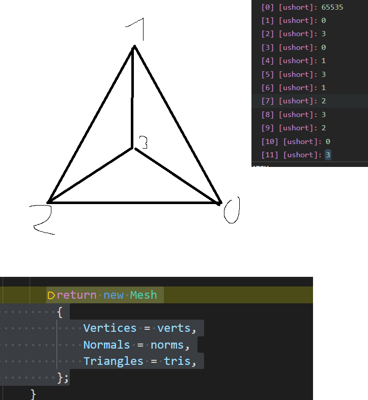

## Aufgabe

`git status`
`git add`
`git commit`

### Teil 1

- X ~~Testet den Code für unterschiedliche Werte für `segments` und macht euch klar, dass jeweils nur das letzte Dreieck fehlt.~~
- X ~~Fügt die Vermaschung für das letzte Dreieck _nach der Schleife_ hinzu, so dass der Zylinder-Boden geschlossen erscheint. Für das
  letzte Dreieck müssen nur Einträge in den `tris`-Array erfolgen. Alle nötigen Punkte für das letzte Dreieck sind bereits
  im `verts`-Array enthalten.~~
- X ~~Wählt einen kleinen Wert für `segments` und zeichnet ein Bild mit den Vertices und den Dreiecken des entstehenden Zylinder-Bodens.
  Schreibt die Array-Inhalte für `verts` und `tris` auf. Zeichnet Verbindungslinien zwischen der Boden-Skizze und den Array-Inhalten,
  die erklären, wie die Array-Inhalte die Geometrie beschreiben.~~

X ~~Hinweise: Die Abgabe muss den Code aus SimpleMeshes.cs enthalten. Scannt/fotografiert Eure Skizze und legt diese der Abgabe als Bild/Pdf hinzu.~~

 Original als .pur

### Teil 2

### Einzelschritte

1. X ~~Verändert im bestehenden Code alle Vertex-Koordinaten so, dass diese um `0.5f * height` Einheiten entlang der Y-Achse    nach oben verschoben werden (Mittelpunkt nicht vergessen).~~

2. X ~~Erweitert die Arrays auf die o.A. Größen und verändert zunächst die Berechnungen der bestehenden Indizes nach
   obigem Schema, so dass nach wie vor nur die obere Deckfläche angelegt wird, allerdings schon an den endgültigen
   Array-Positionen in `tris`, `norms` und `verts`.~~

3. X ~~Fügt Vertices und Dreickslisteneinträge für die untere Deckfläche hinzu. Zur visuellen Kontrolle könnt
   Ihr den Zylinder um seine X- statt um seine Y-Achse rotieren lassen.~~

4.  X ~~Fügt Vertices und Dreickslisteneinträge für die Mantelfläche hinzu.~~

5. Falls noch nicht geschehen: Fügt das Dreiecksvermaschen für alle Flächen des letzten Segmentes außerhalb der
   Schleife hinzu. (Leider fählt da das letzt segment des Mantels!)

### Alternativen / Ausblick / Für Fortgeschrittene

Wem der Einstieg zu schwierig ist und wer noch etwas mehr Sicherheit mit den Grundlagen benötigt, sollte zunächst mal versuchen,
die Methode `SimpleMeshes.CreateTetrahedron()` oder `SimpleMeshes.CreatePyramid()` zu implementieren. Bei beiden
Körpern steht, wie beim Cuboid, zur Compile-Zeit fest, aus wieviel Punkten und Flächen sie bestehen. Somit kann
ohne Schleifen und variable Indexberechnung gearbeitet werden. Stattdessen können, wie beim Cuboid, direkt die Punkte
und Flächen ein die entsprechenden Arrays eingetragen werden und die Indizes direkt als Zahlenwerte eingetragen werden.

Wer mit dem Zylinder gut zurecht kam, kann sich überlegen, wie aus den dabei gewonnenen Erkenntnissen die Methoden
`SimpleMeshes.CreateConeFrustum()` (leicht) oder auch die Methode `SimpleMeshes.CreateTorus()` (schwerer) implementiert
werden können.
